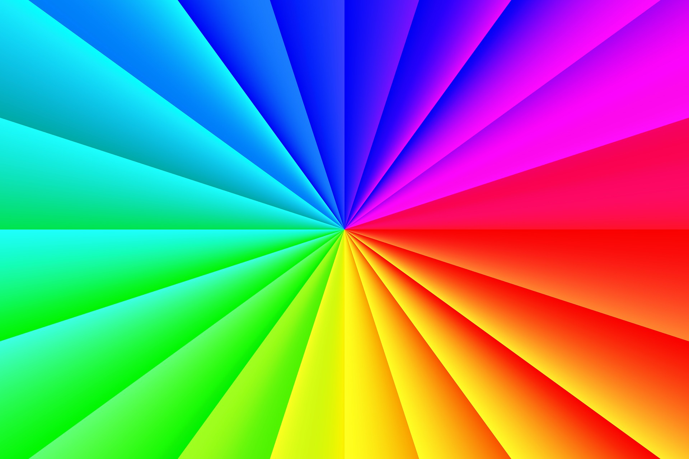

# dynamic-image
[](https://hub.docker.com/r/jnovack/dynamic-image)
[](https://github.com/jnovack/dynamic-image)


**dynamic-image** was created to help assist media developers by
dynamically creating their assets from a known-good master.

## Configuration

### Environment Variables

* `PHP_DIRECTORY_OVERLAYS` - path to overlays (default `/mnt/overlays`)
* `PHP_DIRECTORY_IMAGES` - path to images (default: `/mnt/images`)

## Example

Best run in containers, the idea is to use it as a CDN or image hosting server.

```
$ cd deployments
$ docker-compose up
```

Upload a full-size master:

```
http://localhost:8000/subfolder/rainbow-full.jpg
```
[]()


Then, in your front-end, call the image manipulation as you see fit:

```
http://localhost:8000/subfolder/rainbow-full.jpg?width=640&blur=5&overlay=cancelled&gravity=southwest
```

[]()

There is no need to upload X number of masters at different resolutions, just
generate it.

With the internal php cache, the second view of the same parameters is served
nice and quick.  You can optionally disable the internal php cache and use
caching on the front-end in nginx if you prefer.